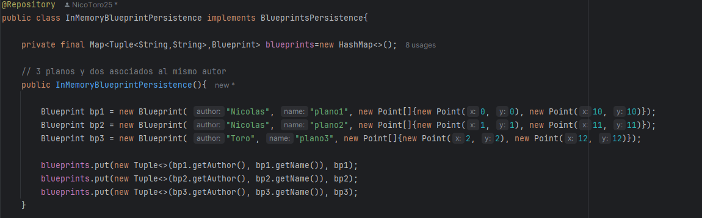

# Arquitecturas de Software (ARSW) - Laboratorio #4

## Componentes y conectores - Parte II.

#### Nicolás Toro

[](https://www.oracle.com/java/)
[](https://maven.apache.org/)

---

En este respositorio se muestra la solución al
[Laboratorio 4](https://github.com/ARSW-ECI-archive/SpringBoot_REST_API_Blueprints_Part2.git)

Se mostró como implementar un controlador REST (APIController) para exponer los servicios de la aplicación.
Además, se implementaron algunos endpoints y se hicieron pruebas.

## Estructura del laboratorio

```bash
├── .idea/                          # Configuración propia de IntelliJ IDEA
├── .mvn/                           # Configuración del wrapper de Maven
│   └── wrapper/                    # Scripts y configuraciones del Maven Wrapper
├── img/                            # Carpeta de imágenes para la documentación
│   └── media/                      # Recursos gráficos de apoyo
├── src/                            # Código fuente del proyecto
│   ├── main/                       # Código principal
│   │   └── java/                   
│   │       └── edu/eci/arsw/blueprints/
│   │           ├── controllers/    # Controladores REST (exponen la API)
│   │           ├── filter/         # Interfaces para aplicar filtros a planos
│   │           │   └── impl/       # Implementaciones concretas de filtros
│   │           ├── model/          # Clases del modelo (Blueprint, Point, etc.)
│   │           ├── persistence/    # Interfaces de persistencia
│   │           │   └── impl/       # Implementación en memoria de la persistencia
│   │           └── services/       # Lógica de negocio (servicios)
│   └── test/                       # Código de pruebas
│       └── java/
│           └── edu/eci/arsw/blueprints/test/
│               └── persistence/
│                   └── impl/       # Pruebas unitarias para la capa de persistencia
└── target/                         # Archivos generados por Maven (build)
    ├── classes/                    # Archivos compilados del main
    │   └── edu/eci/arsw/blueprints/
    │       ├── controllers/        
    │       ├── filter/impl/
    │       ├── model/
    │       ├── persistence/impl/
    │       └── services/
    ├── generated-sources/          # Fuentes generadas automáticamente
    │   └── annotations/
    ├── generated-test-sources/     # Fuentes de pruebas generadas
    │   └── test-annotations/
    ├── maven-archiver/             # Metadatos del build Maven
    ├── maven-status/               # Estado del compilador de Maven
    │   └── maven-compiler-plugin/
    │       ├── compile/default-compile/
    │       └── testCompile/default-testCompile/
    ├── surefire-reports/           # Reportes de ejecución de pruebas
    └── test-classes/               # Archivos compilados de test
        └── edu/eci/arsw/blueprints/test/
            └── persistence/impl/

```
---

### Ejecutar el Proyecto

A continuación, se describen los pasos para ejecutar ambos proyectos en cualquier sistema operativo compatible con Java y Maven.

#### 1. Requisitos previos

- **Java 17** o superior instalado y configurado en el `PATH`.
- **Apache Maven** instalado y configurado en el `PATH`.
- (Opcional) Un IDE como IntelliJ IDEA, Eclipse o VS Code para facilitar la edición y ejecución.

Verifica las versiones instaladas ejecutando en la terminal:

```bash
java -version
mvn -version
```

#### 2. Clonar el repositorio

Si aún no tiene el repositorio localmente, clónelo con:

```bash
git clone https://github.com/NicoToro25/ARSW-Laboratorio-4-Componentes-Conectores-II.git
```

#### 3. Compilar los proyectos

Ejecutar el siguiente código

```bash
mvn clean package
```

#### 4. Ejecutar los proyectos

Ejecutar el siguiente código:

```bash
mvn exec:java@
```

> **Nota:** Si su IDE lo permite, también puede ejecutar directamente las clases principales desde la interfaz gráfica del IDE.

Si se tiene algún inconveniente con la ejecución, asegúrarse de que las variables de entorno de Java y Maven estén correctamente configuradas y de estar ubicado en la carpeta correspondiente antes de ejecutar los comandos.


---

En este ejercicio se va a construír el componente BlueprintsRESTAPI, el cual permita gestionar los planos arquitectónicos de una prestigiosa compañia de diseño. La idea de este API es ofrecer un medio estandarizado e 'independiente de la plataforma' para que las herramientas que se desarrollen a futuro para la compañía puedan gestionar los planos de forma centralizada.
El siguiente, es el diagrama de componentes que corresponde a las decisiones arquitectónicas planteadas al inicio del proyecto:


Donde se definió que:

* El componente BlueprintsRESTAPI debe resolver los servicios de su interfaz a través de un componente de servicios, el
cual -a su vez- estará asociado con un componente que provea el esquema de persistencia. Es decir, se quiere un bajo
acoplamiento entre el API, la implementación de los servicios, y el esquema de persistencia usado por los mismos.

Del anterior diagrama de componentes (de alto nivel), se desprendió el siguiente diseño detallado, cuando se decidió que
el API estará implementado usando el esquema de inyección de dependencias de Spring (el cual requiere aplicar el principio
de Inversión de Dependencias), la extensión SpringMVC para definir los servicios REST, y SpringBoot para la configurar
la aplicación:


### Parte I

1. Integre al proyecto base suministrado los Beans desarrollados en el ejercicio anterior. Sólo copie las clases, NO los
archivos de configuración. Rectifique que se tenga correctamente configurado el esquema de inyección de dependencias con
las anotaciones @Service y @Autowired.

Se modificó el pom.xml para que Springboot administrara el proyecto, por ende, se tuvo que eliminar el archivo appConfig,
además se renombró y se cambió de el contenido del main de la siguiente forma:


2. Modifique el bean de persistecia 'InMemoryBlueprintPersistence' para que por defecto se inicialice con al menos otros
tres planos, y con dos asociados a un mismo autor.

Se pusieron los planos de ejemplo dentro de InMemoryPersistence y se colocó la anotación @Repository
para que SpringBoot lo detecte automáticamente y lo inyecte.



3. Configure su aplicación para que ofrezca el recurso "/blueprints", de manera que cuando se le haga una petición GET, retorne -en formato jSON- el conjunto de todos los planos. Para esto:

	* Modifique la clase BlueprintAPIController teniendo en cuenta el siguiente ejemplo de controlador REST hecho con SpringMVC/SpringBoot:

   ```java
   @RestController
   @RequestMapping(value = "/url-raiz-recurso")
   public class XXController {
   
       
   @RequestMapping(method = RequestMethod.GET)
   public ResponseEntity<?> manejadorGetRecursoXX(){
       try {
           //obtener datos que se enviarán a través del API
           return new ResponseEntity<>(data,HttpStatus.ACCEPTED);
       } catch (XXException ex) {
           Logger.getLogger(XXController.class.getName()).log(Level.SEVERE, null, ex);
           return new ResponseEntity<>("Error bla bla bla",HttpStatus.NOT_FOUND);
       }        
   }

   ```
	* Haga que en esta misma clase se inyecte el bean de tipo BlueprintServices (al cual, a su vez, se le inyectarán sus dependencias de persisntecia y de filtrado de puntos).


4. Verifique el funcionamiento de a aplicación lanzando la aplicación con maven:

   ```bash
   $ mvn compile
   $ mvn spring-boot:run
   
   ```
   Y luego enviando una petición GET a: http://localhost:8080/blueprints. Rectifique que, como respuesta, se obtenga un objeto jSON con una lista que contenga el detalle de los planos suministados por defecto, y que se haya aplicado el filtrado de puntos correspondiente.


5. Modifique el controlador para que ahora, acepte peticiones GET al recurso /blueprints/{author}, el cual retorne
usando una representación jSON todos los planos realizados por el autor cuyo nombre sea {author}. Si no existe dicho
autor, se debe responder con el código de error HTTP 404. Para esto, revise en 
[la documentación de Spring](http://docs.spring.io/spring/docs/current/spring-framework-reference/html/mvc.html), 
sección 22.3.2, el uso de @PathVariable. De nuevo, verifique que al hacer una petición GET -por ejemplo- a recurso 
http://localhost:8080/blueprints/juan, se obtenga en formato jSON el conjunto de planos asociados al autor 'juan' 
(ajuste esto a los nombres de autor usados en el punto 2).


6. Modifique el controlador para que ahora, acepte peticiones GET al recurso /blueprints/{author}/{bpname}, el cual 
retorne usando una representación jSON sólo UN plano, en este caso el realizado por {author} y cuyo nombre sea {bpname}.
De nuevo, si no existe dicho autor, se debe responder con el código de error HTTP 404.


### Parte II

1.  Agregue el manejo de peticiones POST (creación de nuevos planos), de manera que un cliente http pueda registrar una nueva orden haciendo una petición POST al recurso ‘planos’, y enviando como contenido de la petición todo el detalle de dicho recurso a través de un documento jSON. Para esto, tenga en cuenta el siguiente ejemplo, que considera -por consistencia con el protocolo HTTP- el manejo de códigos de estados HTTP (en caso de éxito o error):

	```	java
	@RequestMapping(method = RequestMethod.POST)	
	public ResponseEntity<?> manejadorPostRecursoXX(@RequestBody TipoXX o){
        try {
            //registrar dato
            return new ResponseEntity<>(HttpStatus.CREATED);
        } catch (XXException ex) {
            Logger.getLogger(XXController.class.getName()).log(Level.SEVERE, null, ex);
            return new ResponseEntity<>("Error bla bla bla",HttpStatus.FORBIDDEN);            
        }        
 	
	}
	```	


2.  Para probar que el recurso ‘planos’ acepta e interpreta
	correctamente las peticiones POST, use el comando curl de Unix. Este
	comando tiene como parámetro el tipo de contenido manejado (en este
	caso jSON), y el ‘cuerpo del mensaje’ que irá con la petición, lo
	cual en este caso debe ser un documento jSON equivalente a la clase
	Cliente (donde en lugar de {ObjetoJSON}, se usará un objeto jSON correspondiente a una nueva orden:

	```	
	$ curl -i -X POST -HContent-Type:application/json -HAccept:application/json http://URL_del_recurso_ordenes -d '{ObjetoJSON}'
	```	

	Con lo anterior, registre un nuevo plano (para 'diseñar' un objeto jSON, puede usar [esta herramienta](http://www.jsoneditoronline.org/)):
	

	Nota: puede basarse en el formato jSON mostrado en el navegador al consultar una orden con el método GET.


3. Teniendo en cuenta el autor y nombre del plano registrado, verifique que el mismo se pueda obtener mediante una petición GET al recurso '/blueprints/{author}/{bpname}' correspondiente.


4. Agregue soporte al verbo PUT para los recursos de la forma '/blueprints/{author}/{bpname}', de manera que sea posible actualizar un plano determinado.


### Parte III

El componente BlueprintsRESTAPI funcionará en un entorno concurrente. Es decir, atederá múltiples peticiones simultáneamente (con el stack de aplicaciones usado, dichas peticiones se atenderán por defecto a través múltiples de hilos). Dado lo anterior, debe hacer una revisión de su API (una vez funcione), e identificar:

* Qué condiciones de carrera se podrían presentar?
* Cuales son las respectivas regiones críticas?

Ajuste el código para suprimir las condiciones de carrera. Tengan en cuenta que simplemente sincronizar el acceso a las operaciones de persistencia/consulta DEGRADARÁ SIGNIFICATIVAMENTE el desempeño de API, por lo cual se deben buscar estrategias alternativas.

Escriba su análisis y la solución aplicada en el archivo ANALISIS_CONCURRENCIA.txt

#### Criterios de evaluación

1. Diseño.
	* Al controlador REST implementado se le inyectan los servicios implementados en el laboratorio anterior.
	* Todos los recursos asociados a '/blueprint' están en un mismo Bean.
	* Los métodos que atienden las peticiones a recursos REST retornan un código HTTP 202 si se procesaron adecuadamente, y el respectivo código de error HTTP si el recurso solicitado NO existe, o si se generó una excepción en el proceso (dicha excepción NO DEBE SER de tipo 'Exception', sino una concreta)
2. Funcionalidad.
	* El API REST ofrece los recursos, y soporta sus respectivos verbos, de acuerdo con lo indicado en el enunciado.
3. Análisis de concurrencia.
	* En el código, y en las respuestas del archivo de texto, se tuvo en cuenta:
		* La colección usada en InMemoryBlueprintPersistence no es Thread-safe (se debió cambiar a una con esta condición).
		* El método que agrega un nuevo plano está sujeta a una condición de carrera, pues la consulta y posterior agregación (condicionada a la anterior) no se realizan de forma atómica. Si como solución usa un bloque sincronizado, se evalúa como R. Si como solución se usaron los métodos de agregación condicional atómicos (por ejemplo putIfAbsent()) de la colección 'Thread-Safe' usada, se evalúa como B.